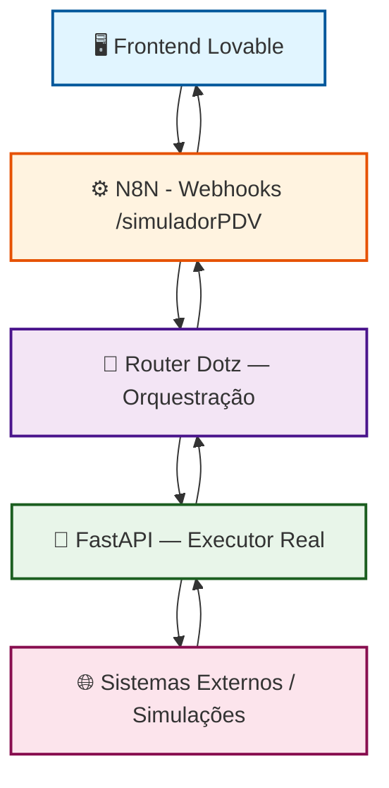
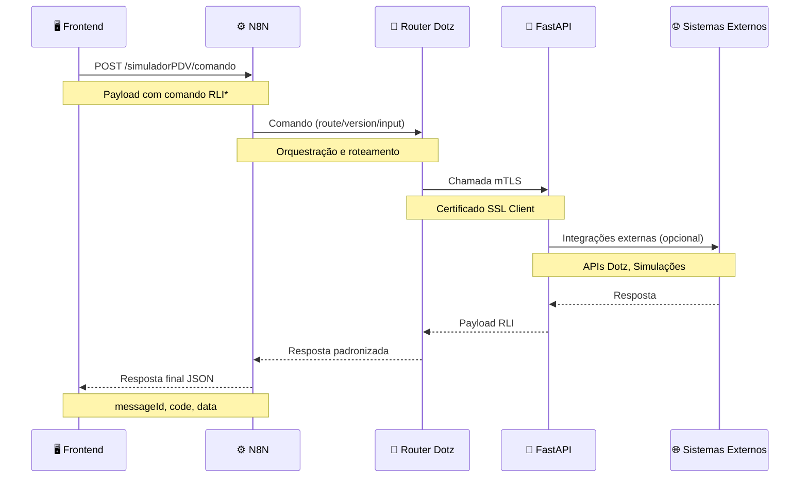

# 📘 Backend N8N - Documentação Técnica

> Workflows N8N do Simulador PDV - Orquestração entre Frontend, Router Dotz e FastAPI

**Última atualização:** 28/11/2025


---

## 📋 Índice

- [1. Introdução](#1-introdução)
  - [Objetivos desta Documentação](#objetivos-desta-documentação)
- [2. Topologia da Arquitetura](#2-topologia-da-arquitetura)
  - [Visão Geral](#visão-geral)
  - [Papéis de Cada Camada](#papéis-de-cada-camada)
- [3. Estrutura de Diretórios](#3-estrutura-de-diretórios)
- [4. Guia de Importação](#4-guia-de-importação)
  - [Passo 1: Acessar o N8N](#passo-1-acessar-o-n8n)
  - [Passo 2: Importar os Arquivos](#passo-2-importar-os-arquivos)
  - [Passo 3: Resolver Credenciais](#passo-3-resolver-credenciais)
  - [Passo 4: Variáveis de Ambiente](#passo-4-variáveis-de-ambiente)
- [5. Mapeamento de Endpoints](#5-mapeamento-de-endpoints)
  - [5.1 Autenticação](#51-autenticação)
  - [5.2 Empresas](#52-empresas)
  - [5.3 Usuários](#53-usuários)
  - [5.4 Fluxos](#54-fluxos)
  - [5.5 Comandos RLI*](#55-comandos-rli)
- [6. Dependências Supabase](#6-dependências-supabase)
- [7. Segurança e Boas Práticas](#7-segurança-e-boas-práticas)
- [8. Integração com FastAPI](#8-integração-com-fastapi)
- [9. Referências Cruzadas](#9-referências-cruzadas)
- [10. Conclusão](#10-conclusão)

---

## 1. Introdução

Este diretório contém os **workflows do N8N** utilizados pelo backend do Simulador PDV, fazendo a ponte entre o frontend (Lovable), o Router Dotz e o backend FastAPI interno.

### Objetivos desta Documentação

- ✅ Explicar como os webhooks do N8N funcionam internamente
- ✅ Mostrar como eles se relacionam com o frontend
- ✅ Detalhar como se conectam com o Router Dotz
- ✅ Explicar o papel do FastAPI, que executa de fato as integrações
- ✅ Documentar dependências e requisitos para importar os flows no ambiente corporativo
- ✅ Servir como referência oficial do backend orquestrador do Simulador PDV

---

## 2. Topologia da Arquitetura

### Visão Geral



### Papéis de Cada Camada

#### 🖥️ Frontend (Lovable)

- **Interface do usuário**
- Chama apenas endpoints do N8N (`/simuladorPDV/*`)
- **Documentação oficial:** 👉 [API_ENDPOINTS.md](./API_ENDPOINTS.md)

#### ⚙️ N8N — Backend Orquestrador Nº1

Responsável por:

- Receber chamadas do frontend através de webhooks
- Validar payloads e headers
- Consultar o Supabase
- Determinar qual comando `RLI*` deve ser executado
- Montar o payload enviado ao Router
- Encaminhar tudo para o Router, que chamará o FastAPI

> ⚠️ **Importante:** O N8N **não chama serviços externos diretamente**. Isto é papel do FastAPI.

#### 🔀 Router Dotz

**Funções:**

- Recebe comandos padronizados do N8N
- Aplica o modelo `route/version/input`
- Aciona o FastAPI
- Retorna resposta RLI ao N8N

Ele é apenas uma **camada de orquestração**.

#### 🚀 FastAPI — Backend Executor Real

**Funções:**

- Recebe requisições do Router usando **mTLS**
- Autenticação via **API-KEY** ou **JWT**
- Executa chamadas externas reais
- Aplica regras de negócio
- Retorna resposta no contrato RLI

**Código fonte:** 👉 [/fastapi/](../fastapi/)

---

## 3. Estrutura de Diretórios

```
n8n-flows/
├── exports/          # JSONs dos workflows exportados do N8N
│   ├── webhook-simuladorpdv-empresa.json
│   ├── webhook-simuladorpdv-fluxo.json
│   ├── webhook-simuladorpdv-produtos.json
│   ├── webhook-simuladorpdv-relatorios.json
│   ├── webhook-simuladorpdv-router.json
│   ├── webhook-simuladorpdv-usuario.json
│   ├── simuladorpdv-router-credencial.json
│   ├── simuladorpdv-router-rliauth.json
│   ├── simuladorpdv-router-rlicell.json
│   ├── simuladorpdv-router-rlideal-v2.json
│   ├── simuladorpdv-router-rlideal.json
│   ├── simuladorpdv-router-rlifund.json
│   ├── simuladorpdv-router-rliinfo.json
│   ├── simuladorpdv-router-rlipays.json
│   ├── simuladorpdv-router-rliquit.json
│   ├── simuladorpdv-router-rliundo.json
│   └── simuladorpdv-router-rliwait.json
└── docs/             # Documentação do backend N8N (este arquivo)
```

---

## 4. Guia de Importação

### Passo 1: Acessar o N8N

Menu lateral → **Workflows** → **Import from File**

### Passo 2: Importar os Arquivos

Arquivos localizados em:

```
n8n-flows/exports/
```

Importe todos os arquivos `.json` disponíveis na pasta.

### Passo 3: Resolver Credenciais

Após a importação, configure as credenciais necessárias:

| Nome da Credencial   | Tipo                 | Usado por               | Descrição                          |
|----------------------|----------------------|-------------------------|------------------------------------|
| `header-simulador-pdv` | Header Auth        | Todos os webhooks       | Autenticação dos webhooks do N8N   |
| `Supabase - DB Geral`  | HTTP ou Supabase API | CRUD / permissões     | Acesso ao banco Supabase           |
| `Certificado Router`   | SSL Auth           | Fluxos RLI*             | Certificado mTLS para Router       |
| `Router BasicAuth`     | Basic Auth         | Serviços RLI via Router | Autenticação básica no Router      |

### Passo 4: Variáveis de Ambiente

Configure as seguintes variáveis no ambiente corporativo:

- ✅ **Client ID / Secret do Router**
- ✅ **CNPJ utilizado para a simulação**
- ✅ **PFX ou PEM compatível com o Router**
- ✅ **Acesso ao Supabase corporativo**

---

## 5. Mapeamento de Endpoints

### 5.1 Autenticação

| Ação       | Endpoint Frontend                  | Workflow N8N                      | Descrição                    |
|------------|------------------------------------|-----------------------------------|------------------------------|
| Login      | `POST /simuladorPDV/validaUsuario` | webhook - simulador PDV (usuário) | Autenticação de usuários     |
| Permissões | `GET /simuladorPDV/permissoes_usuario` | webhook - simulador PDV (usuário) | Consulta de permissões       |

### 5.2 Empresas

| Ação   | Endpoint Frontend    | Workflow N8N          | Descrição                |
|--------|----------------------|-----------------------|--------------------------|
| Criar  | `POST /empresas`     | webhook - empresa     | Cadastro de empresa      |
| Listar | `GET /empresas`      | webhook - empresa     | Listagem de empresas     |
| Editar | `PUT /empresas`      | webhook - empresa     | Atualização de empresa   |

### 5.3 Usuários

| Endpoint Frontend     | Workflow N8N          | Descrição                    |
|-----------------------|-----------------------|------------------------------|
| `/usuarios`           | webhook - usuário     | CRUD de usuários             |
| `/usuarios_teste`     | webhook - usuário     | Gerenciamento de testes      |

### 5.4 Fluxos

| Endpoint Frontend           | Workflow N8N        | Descrição                        |
|-----------------------------|---------------------|----------------------------------|
| `/consultaFluxo`            | webhook - fluxo     | Consulta de fluxos disponíveis   |
| `/consultaFluxoDetalhe`     | webhook - fluxo     | Detalhes de um fluxo específico  |

### 5.5 Comandos RLI*

| Endpoint Frontend | Workflow N8N                  | Rota após o N8N  | Descrição                    |
|-------------------|-------------------------------|------------------|------------------------------|
| `POST /comando`   | Serviços Router + fluxos RLI* | Router → FastAPI | Execução de comandos RLI     |

#### Fluxo Completo de Comando



**Comandos RLI disponíveis:**

- `RLIINFO` - Informações do cliente
- `RLIFUND` - Consulta de fundos disponíveis
- `RLIDEAL` - Criação de transação
- `RLIAUTH` - Autenticação de pagamento
- `RLIPAYS` - Confirmação de pagamento
- `RLIWAIT` - Aguardar processamento
- `RLIQUIT` - Cancelamento
- `RLIUNDO` - Estorno
- `RLICELL` - Validação de telefone

---

## 6. Dependências Supabase

### Tabelas Utilizadas

| Tabela                  | Descrição                                |
|-------------------------|------------------------------------------|
| `simuladorpdv_auth`     | Autenticação e sessões de usuários       |
| `simuladorPDV_empresa`  | Cadastro de empresas                     |
| `simuladorPDV_perfil`   | Perfis de usuário e permissões           |
| `simuladorPDV_fluxo`    | Fluxos de pagamento disponíveis          |
| `simuladorPDV_usuarios` | Usuários do sistema                      |

### Funções RPC

| Função                          | Descrição                              |
|---------------------------------|----------------------------------------|
| `permissoes_por_usuario(uuid)`  | Retorna permissões de um usuário       |

---

## 7. Segurança e Boas Práticas

- 🔒 **Nunca versionar certificados reais** (PFX/PEM)
- 🔒 **Nunca versionar** `client_secret` do Router
- 🔒 Toda credencial deve ser configurada via **N8N corporativo**
- 📊 Logs do FastAPI devem estar **habilitados** no ambiente de produção/homologação
- ⚙️ Preferir **variáveis de ambiente** para tudo relacionado ao Router
- 🔐 Usar **mTLS** para comunicação Router ↔ FastAPI
- ✅ Validar **headers** e **payloads** em todos os webhooks
- 🛡️ Implementar **rate limiting** nos webhooks públicos
- 📝 Manter **logs estruturados** para auditoria

---

## 8. Integração com FastAPI

A documentação complementar do FastAPI estará em:

👉 **[fastapi/docs/README.md](../fastapi/docs/README.md)** *(a ser criado)*

Incluindo:

- ⚙️ Variáveis de ambiente
- 🔗 Comportamento dos endpoints
- 📋 Exemplos de chamadas
- 🏗️ Topologia interna do FastAPI
- 🔐 Configuração de certificados mTLS
- 🧪 Testes e validações

**Código fonte FastAPI:**

```
fastapi/
├── app/
│   ├── main.py              # Aplicação principal
│   └── ...
├── Dockerfile               # Containerização
├── docker-compose.yml       # Orquestração local
└── requirements.txt         # Dependências Python
```

---

## 9. Referências Cruzadas

### Documentação do Projeto

| Documento | Descrição | Link |
|-----------|-----------|------|
| **API Endpoints** | Documentação completa da API do frontend | [API_ENDPOINTS.md](./API_ENDPOINTS.md) |
| **Arquitetura** | Visão geral da arquitetura do sistema | [ARCHITECTURE.md](./ARCHITECTURE.md) |
| **Guia de Retry** | Estratégias de retry e error handling | [RETRY_GUIDE.md](./RETRY_GUIDE.md) |
| **Guia de Testes** | Testes unitários e E2E | [TESTING_GUIDE.md](./TESTING_GUIDE.md) |
| **Guia de Validação** | Schemas e validações | [VALIDATION_GUIDE.md](./VALIDATION_GUIDE.md) |

### Código Fonte

| Componente | Localização |
|------------|-------------|
| **FastAPI** | [/fastapi/](../fastapi/) |
| **Frontend** | [/src/](../src/) |
| **N8N Exports** | [/n8n-flows/exports/](../n8n-flows/exports/) |
| **E2E Tests** | [/e2e/](../e2e/) |

---

## 10. Conclusão

Esta documentação explica em profundidade:

- ✅ Como os flows do N8N operam
- ✅ Como se conectam ao Router
- ✅ Como o Router aciona o FastAPI
- ✅ Como o frontend consome tudo isso
- ✅ Dependências, credenciais e configurações necessárias
- ✅ Boas práticas de segurança e manutenção

Com os **17 workflows versionados** e esta documentação, o time técnico corporativo tem tudo para implantar o backend do Simulador PDV em um ambiente padronizado, seguro e profissional.

---

### 📞 Suporte

Para dúvidas ou sugestões sobre esta documentação:

- 📧 Abra uma issue no repositório
- 💬 Entre em contato com o time de desenvolvimento
- 📚 Consulte as [referências cruzadas](#9-referências-cruzadas)

---

**Versão:** 1.0.0  
**Última revisão:** 28/11/2025  
**Mantenedores:** Time de Desenvolvimento Simulador PDV
