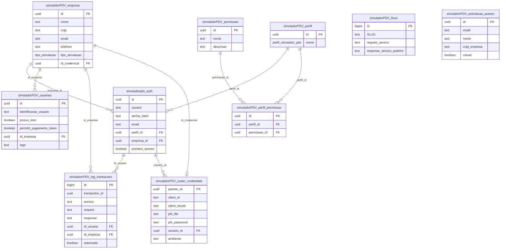

# 📊 Database Schema - SimuladorPDV


**Última Revisão:** 2025-11-28  
**Versão:** 1.0.0

---

## 📑 Índice

1. [Introdução](#-introdução)
2. [Diagrama Entidade-Relacionamento](#-diagrama-entidade-relacionamento)
3. [Tabelas por Contexto](#-tabelas-por-contexto)
   - [Autenticação e Autorização](#autenticação-e-autorização)
   - [Empresas e Credenciais](#empresas-e-credenciais)
   - [Simulação e Transações](#simulação-e-transações)
4. [Tipos Enumerados](#-tipos-enumerados)
5. [Resumo de Relacionamentos](#-resumo-de-relacionamentos)
6. [DDL Completo](#-ddl-completo)
7. [Boas Práticas e Observações](#-boas-práticas-e-observações)
8. [Referências Cruzadas](#-referências-cruzadas)

---

## 🎯 Introdução

Este documento apresenta o esquema completo do banco de dados do **SimuladorPDV**, uma aplicação desenvolvida para simular operações de ponto de venda (PDV) integradas ao ecossistema Dotz. O banco de dados foi projetado usando PostgreSQL/Supabase e organiza-se em três contextos principais:

- **Autenticação e Autorização**: Gestão de usuários, perfis e permissões
- **Empresas e Credenciais**: Cadastro de empresas parceiras e suas credenciais de API
- **Simulação e Transações**: Usuários de teste, fluxos de simulação e logs de transações

O esquema suporta dois modos de operação:
- **ONLINE**: Integração real com o Router Dotz via credenciais e certificados mTLS
- **OFFLINE**: Simulação local sem comunicação externa

---

## 🗺️ Diagrama Entidade-Relacionamento



---

## 📚 Tabelas por Contexto

### Autenticação e Autorização

#### 📋 simuladorpdv_auth

> Tabela principal de autenticação de usuários do sistema. Armazena credenciais, perfis de acesso e vinculação com empresas.

| Coluna | Tipo | Nullable | Default | Descrição |
|--------|------|----------|---------|-----------|
| `id` | uuid | ❌ | uuid_generate_v4() | **PK** - Identificador único do usuário |
| `usuario` | text | ❌ | - | Nome de usuário (login) - **UNIQUE** |
| `senha_hash` | text | ❌ | - | Hash da senha (bcrypt/argon2) |
| `nome` | text | ✅ | - | Nome completo do usuário |
| `criado_em` | timestamp | ✅ | now() | Data/hora de criação do registro |
| `email` | text | ❌ | - | E-mail do usuário - **UNIQUE** |
| `perfil_id` | uuid | ❌ | - | **FK** - Referência ao perfil de acesso |
| `empresa_id` | uuid | ✅ | - | **FK** - Empresa vinculada ao usuário |
| `primeiro_acesso` | boolean | ❌ | false | Indica se é o primeiro acesso (para forçar troca de senha) |

**🔗 Foreign Keys:**
- `perfil_id` → `simuladorPDV_perfil(id)`
- `empresa_id` → `simuladorPDV_empresa(id)`

**🔐 Índices Únicos:**
- `simuladorpdv_auth_usuario_key` em `(usuario)`
- `simuladorpdv_auth_email_key` em `(email)`

**📝 Observações:**
- Senhas devem ser armazenadas com hash forte (bcrypt, argon2)
- O campo `primeiro_acesso` é usado para forçar redefinição de senha
- Usuários podem estar ou não vinculados a uma empresa específica

---

#### 📋 simuladorPDV_perfil

> Define os perfis de acesso disponíveis no sistema (ADMIN, USER, etc.). Utiliza tipo enumerado para garantir valores válidos.

| Coluna | Tipo | Nullable | Default | Descrição |
|--------|------|----------|---------|-----------|
| `id` | uuid | ❌ | gen_random_uuid() | **PK** - Identificador único do perfil |
| `created_at` | timestamptz | ❌ | now() | Data/hora de criação do registro |
| `nome` | perfil_simulador_pdv | ❌ | 'USER' | Nome do perfil (ENUM) |

**🔗 Foreign Keys:** Nenhuma

**🔐 Índices Únicos:** Nenhum

**📝 Observações:**
- Utiliza tipo enumerado `perfil_simulador_pdv` para garantir consistência
- Perfis comuns: `ADMIN`, `USER`, `MANAGER`, etc.
- Novos perfis devem ser criados alterando o ENUM no banco

---

#### 📋 simuladorPDV_permissao

> Catálogo de permissões disponíveis no sistema. Cada permissão representa uma ação ou recurso específico.

| Coluna | Tipo | Nullable | Default | Descrição |
|--------|------|----------|---------|-----------|
| `id` | uuid | ❌ | gen_random_uuid() | **PK** - Identificador único da permissão |
| `created_at` | timestamptz | ❌ | now() | Data/hora de criação do registro |
| `nome` | text | ❌ | - | Nome identificador da permissão (ex: "view_reports") |
| `descricao` | text | ✅ | - | Descrição detalhada da permissão |

**🔗 Foreign Keys:** Nenhuma

**🔐 Índices Únicos:** Nenhum

**📝 Observações:**
- Permissões são granulares e representam ações específicas
- Exemplos: `view_transactions`, `edit_users`, `manage_companies`, `export_reports`
- A descrição ajuda a documentar o propósito de cada permissão

---

#### 📋 simuladorPDV_perfil_permissao

> Tabela de junção N:N entre perfis e permissões. Implementa o sistema RBAC (Role-Based Access Control).

| Coluna | Tipo | Nullable | Default | Descrição |
|--------|------|----------|---------|-----------|
| `id` | uuid | ❌ | gen_random_uuid() | **PK** - Identificador único do vínculo |
| `created_at` | timestamptz | ❌ | now() | Data/hora de criação do registro |
| `perfil_id` | uuid | ❌ | - | **FK** - Referência ao perfil |
| `permissao_id` | uuid | ❌ | - | **FK** - Referência à permissão |

**🔗 Foreign Keys:**
- `perfil_id` → `simuladorPDV_perfil(id)`
- `permissao_id` → `simuladorPDV_permissao(id)`

**🔐 Índices Únicos:** Nenhum (mas recomenda-se criar unique constraint em `(perfil_id, permissao_id)`)

**📝 Observações:**
- Permite flexibilidade na atribuição de permissões a perfis
- Recomenda-se adicionar constraint unique para evitar duplicatas: `UNIQUE(perfil_id, permissao_id)`
- Facilita a gestão de permissões via interface administrativa

---

### Empresas e Credenciais

#### 📋 simuladorPDV_empresa

> Cadastro de empresas parceiras que utilizam o simulador. Cada empresa pode ter suas próprias credenciais de API.

| Coluna | Tipo | Nullable | Default | Descrição |
|--------|------|----------|---------|-----------|
| `id` | uuid | ❌ | gen_random_uuid() | **PK** - Identificador único da empresa |
| `created_at` | timestamptz | ❌ | now() | Data/hora de criação do registro |
| `nome` | text | ❌ | - | Razão social da empresa |
| `cnpj` | text | ❌ | - | CNPJ da empresa (formato: 00.000.000/0000-00) |
| `email` | text | ✅ | - | E-mail de contato da empresa |
| `telefone` | text | ✅ | - | Telefone de contato |
| `endereco` | text | ✅ | - | Endereço completo da empresa |
| `descricao` | text | ✅ | - | Descrição ou observações sobre a empresa |
| `tipo_simulacao` | tipo_simulacao_simulador_pdv | ✅ | 'OFFLINE' | Modo de operação: ONLINE ou OFFLINE |
| `id_credencial` | uuid | ✅ | - | **FK** - Credenciais de API (quando ONLINE) |

**🔗 Foreign Keys:**
- `id_credencial` → `simuladorPDV_router_credentials(partner_id)`

**🔐 Índices Únicos:** Nenhum (recomenda-se criar unique constraint em `cnpj`)

**📝 Observações:**
- `tipo_simulacao = OFFLINE`: Simulação local sem comunicação externa
- `tipo_simulacao = ONLINE`: Integração real com Router Dotz (requer `id_credencial`)
- CNPJ deve ser validado antes da inserção
- Recomenda-se adicionar: `UNIQUE(cnpj)` e validação de formato

---

#### 📋 simuladorPDV_router_credentials

> Credenciais de autenticação para integração com o Router Dotz. Armazena client_id, client_secret, certificados mTLS e configurações de ambiente.

| Coluna | Tipo | Nullable | Default | Descrição |
|--------|------|----------|---------|-----------|
| `partner_id` | uuid | ❌ | gen_random_uuid() | **PK** - Identificador único da credencial |
| `client_id` | text | ❌ | - | Client ID fornecido pela Dotz |
| `client_secret` | text | ❌ | - | Client Secret (deve ser criptografado) |
| `pfx_file` | text | ❌ | - | Certificado mTLS em formato base64 |
| `pfx_password` | text | ❌ | - | Senha do certificado PFX |
| `enabled` | boolean | ❌ | true | Indica se a credencial está ativa |
| `updated_at` | timestamptz | ❌ | now() | Data/hora da última atualização |
| `usuario_id` | uuid | ✅ | gen_random_uuid() | **FK** - Usuário responsável pela credencial |
| `description` | text | ✅ | - | Descrição ou identificação da credencial |
| `cnpj_id` | text | ✅ | - | CNPJ associado à credencial na Dotz |
| `ambiente` | text | ✅ | 'UAT' | Ambiente: UAT, PRODUCTION, etc. |

**🔗 Foreign Keys:**
- `usuario_id` → `simuladorpdv_auth(id)`

**🔐 Índices Únicos:** Nenhum

**⚠️ CRÍTICO - Segurança:**
- `client_secret` e `pfx_password` **DEVEM** ser criptografados (AES-256-GCM)
- Certificados PFX armazenados em base64 contêm chaves privadas
- Recomenda-se usar Supabase Vault ou secrets management
- Nunca versionar credenciais em Git
- Implementar rotação periódica de secrets

**📝 Observações:**
- Suporta múltiplos ambientes (UAT, PRODUCTION)
- Uma empresa pode ter múltiplas credenciais (uma por ambiente)
- Campo `enabled` permite desativar credenciais sem deletá-las

---

#### 📋 simuladorPDV_solicitacao_acesso

> Registro de solicitações de acesso ao sistema feitas por novos usuários ou empresas. Funciona como uma fila de aprovação.

| Coluna | Tipo | Nullable | Default | Descrição |
|--------|------|----------|---------|-----------|
| `id` | uuid | ❌ | gen_random_uuid() | **PK** - Identificador único da solicitação |
| `created_at` | timestamptz | ❌ | now() | Data/hora da solicitação |
| `email` | text | ❌ | - | E-mail do solicitante |
| `nome` | text | ❌ | - | Nome do solicitante |
| `nome_empresa` | text | ❌ | - | Nome da empresa solicitante |
| `cnpj_empresa` | text | ❌ | - | CNPJ da empresa |
| `visivel` | boolean | ❌ | true | Controla visibilidade (soft delete) |

**🔗 Foreign Keys:** Nenhuma

**🔐 Índices Únicos:** Nenhum

**📝 Observações:**
- Funciona como uma fila de aprovação de novos acessos
- `visivel = false` implementa soft delete
- Após aprovação, deve-se criar registros em `simuladorPDV_empresa` e `simuladorpdv_auth`
- Recomenda-se implementar workflow de aprovação com notificações

---

### Simulação e Transações

#### 📋 simuladorPDV_usuarios

> Cadastro de usuários de teste (CPFs simulados) para realizar transações. Permite configurar comportamentos específicos para cada CPF.

| Coluna | Tipo | Nullable | Default | Descrição |
|--------|------|----------|---------|-----------|
| `id` | uuid | ❌ | uuid_generate_v4() | **PK** - Identificador único do usuário de teste |
| `created_at` | timestamptz | ❌ | now() | Data/hora de criação do registro |
| `identificacao_usuario` | text | ❌ | - | CPF do usuário de teste (11 dígitos) |
| `pedir_telefone` | boolean | ✅ | true | Se deve solicitar telefone no fluxo |
| `possui_dotz` | boolean | ❌ | true | Se o usuário possui pontos Dotz |
| `outros_meios_pagamento` | boolean | ❌ | false | Se permite outras formas de pagamento |
| `dotz_sem_app` | boolean | ❌ | false | Se permite usar Dotz sem app instalado |
| `permitir_pagamento_token` | boolean | ❌ | false | Se permite pagamento via token |
| `id_empresa` | uuid | ✅ | - | **FK** - Empresa associada ao usuário de teste |
| `nome` | text | ✅ | - | Nome fictício do usuário de teste |
| `tags` | text | ✅ | - | Tags para categorização (JSON ou CSV) |
| `data_nascimento` | date | ✅ | - | Data de nascimento (para validação OTP) |

**🔗 Foreign Keys:**
- `id_empresa` → `simuladorPDV_empresa(id)`

**🔐 Índices Únicos:** Nenhum (recomenda-se criar unique constraint em `(identificacao_usuario, id_empresa)`)

**📝 Observações:**
- `identificacao_usuario` deve conter CPF válido (validação Mod-11)
- Flags booleanas permitem simular diferentes cenários de comportamento
- `tags` pode armazenar JSON: `{"scenario": "happy_path", "category": "gold"}`
- Cada empresa pode ter seus próprios usuários de teste
- `data_nascimento` é usada para validação de OTP em fluxos específicos

**💡 Exemplo de Uso:**
```sql
-- CPF de teste que possui Dotz e permite token
INSERT INTO simuladorPDV_usuarios (
  identificacao_usuario, nome, possui_dotz, 
  permitir_pagamento_token, id_empresa
) VALUES (
  '12345678901', 'João Teste', true, true, 
  '550e8400-e29b-41d4-a716-446655440000'
);
```

---

#### 📋 simuladorPDV_log_transacoes

> Registro completo de todas as transações realizadas no simulador. Armazena requests, responses e permite estornos.

| Coluna | Tipo | Nullable | Default | Descrição |
|--------|------|----------|---------|-----------|
| `id` | bigint | ❌ | IDENTITY | **PK** - Identificador único do log |
| `created_at` | timestamptz | ❌ | now() | Data/hora da transação |
| `transaction_id` | uuid | ✅ | gen_random_uuid() | ID único da transação (usado para rastreamento) |
| `servico` | text | ✅ | - | Nome do serviço chamado (RLIAUTH, RLIPAYS, etc.) |
| `request` | text | ✅ | - | Payload da requisição (JSON como texto) |
| `response` | text | ✅ | - | Resposta do serviço (JSON como texto) |
| `id_usuario` | uuid | ✅ | gen_random_uuid() | **FK** - Usuário que executou a transação |
| `id_empresa` | uuid | ✅ | gen_random_uuid() | **FK** - Empresa associada à transação |
| `estornado` | boolean | ✅ | false | Indica se a transação foi estornada |

**🔗 Foreign Keys:**
- `id_usuario` → `simuladorpdv_auth(id)`
- `id_empresa` → `simuladorPDV_empresa(id)`

**🔐 Índices Únicos:** Nenhum

**📌 Recomendações de Índices:**
```sql
-- Melhora performance de consultas por transaction_id
CREATE INDEX idx_log_transacoes_transaction_id ON simuladorPDV_log_transacoes(transaction_id);

-- Melhora filtros por empresa e usuário
CREATE INDEX idx_log_transacoes_empresa_usuario ON simuladorPDV_log_transacoes(id_empresa, id_usuario);

-- Melhora filtros por data
CREATE INDEX idx_log_transacoes_created_at ON simuladorPDV_log_transacoes(created_at DESC);

-- Melhora consultas de transações estornadas
CREATE INDEX idx_log_transacoes_estornado ON simuladorPDV_log_transacoes(estornado) WHERE estornado = true;
```

**📝 Observações:**
- `transaction_id` é usado para rastreamento end-to-end
- `request` e `response` armazenam JSON como texto (considerar tipo `jsonb` para queries)
- `estornado` marca transações revertidas (via RLIQUIT)
- Logs são imutáveis - nunca deletar, apenas marcar como estornado
- Implementar política de retenção (arquivar logs antigos)

**💡 Exemplo de Uso:**
```sql
-- Buscar transações de uma empresa em um período
SELECT 
  transaction_id, servico, created_at, estornado
FROM simuladorPDV_log_transacoes
WHERE id_empresa = '550e8400-e29b-41d4-a716-446655440000'
  AND created_at >= '2025-01-01'
  AND created_at < '2025-02-01'
ORDER BY created_at DESC;
```

---

#### 📋 simuladorPDV_fluxo

> Define os estados e transições do fluxo de simulação. Mapeia quais serviços devem ser chamados em cada etapa.

| Coluna | Tipo | Nullable | Default | Descrição |
|--------|------|----------|---------|-----------|
| `id` | bigint | ❌ | IDENTITY | **PK** - Identificador único do estado |
| `created_at` | timestamptz | ❌ | now() | Data/hora de criação do registro |
| `SLUG` | text | ❌ | - | Identificador único do estado (ex: "cpf", "scan") |
| `request_servico` | text | ✅ | - | Nome do comando RLI* a ser executado |
| `response_servico_anterior` | text | ✅ | - | Resposta esperada do estado anterior |
| `nome_request_servico` | text | ✅ | - | Nome legível do serviço de request |
| `nome_response_servico` | text | ✅ | - | Nome legível do serviço de response |

**🔗 Foreign Keys:** Nenhuma

**🔐 Índices Únicos:** Recomenda-se `UNIQUE(SLUG)`

**📝 Observações:**
- `SLUG` representa o estado da máquina de estados (state machine)
- `request_servico` mapeia para comandos RLI* (RLIAUTH, RLIPAYS, etc.)
- `response_servico_anterior` define transições condicionais
- Utilizado pela consultaFluxoService para determinar próximo passo

**💡 Exemplo de Fluxo:**
```
SLUG: "cpf" 
  → request_servico: "RLIAUTH"
  → próximo estado: "scan" (se autenticação OK)

SLUG: "scan"
  → request_servico: "RLIINFO" 
  → próximo estado: "meios-de-pagamento"

SLUG: "meios-de-pagamento"
  → request_servico: null
  → próximo estado: depende da escolha do usuário
```

**🔗 Referência:** Consulte `docs/BACKEND_ARCHITECTURE.md` para diagrama completo do fluxo

---

## 🏷️ Tipos Enumerados

### tipo_simulacao_simulador_pdv

Define os modos de operação do simulador:

```sql
CREATE TYPE public.tipo_simulacao_simulador_pdv AS ENUM (
  'ONLINE',   -- Integração real com Router Dotz
  'OFFLINE'   -- Simulação local sem comunicação externa
);
```

**Uso:**
- `simuladorPDV_empresa.tipo_simulacao`
- Determina se a empresa opera em modo conectado ou simulado
- `ONLINE` requer `id_credencial` configurado

---

### perfil_simulador_pdv

Define os perfis de acesso disponíveis no sistema:

```sql
CREATE TYPE public.perfil_simulador_pdv AS ENUM (
  'ADMIN',      -- Administrador com acesso total
  'USER',       -- Usuário padrão com acesso limitado
  'MANAGER',    -- Gerente com permissões intermediárias
  'VIEWER'      -- Apenas visualização (somente leitura)
);
```

**Uso:**
- `simuladorPDV_perfil.nome`
- Controla o nível de acesso às funcionalidades
- Perfis são associados a permissões via `simuladorPDV_perfil_permissao`

**📝 Observações:**
- Para adicionar novos perfis, é necessário alterar o tipo ENUM no banco
- Comando: `ALTER TYPE perfil_simulador_pdv ADD VALUE 'NOVO_PERFIL';`

---

## 🔗 Resumo de Relacionamentos

| Tabela Origem | Coluna | Tabela Destino | Coluna Destino | Tipo | Descrição |
|--------------|--------|----------------|----------------|------|-----------|
| `simuladorpdv_auth` | `perfil_id` | `simuladorPDV_perfil` | `id` | N:1 | Usuário possui um perfil |
| `simuladorpdv_auth` | `empresa_id` | `simuladorPDV_empresa` | `id` | N:1 | Usuário vinculado a uma empresa |
| `simuladorPDV_empresa` | `id_credencial` | `simuladorPDV_router_credentials` | `partner_id` | 1:1 | Empresa possui credenciais |
| `simuladorPDV_perfil_permissao` | `perfil_id` | `simuladorPDV_perfil` | `id` | N:1 | Perfil possui múltiplas permissões |
| `simuladorPDV_perfil_permissao` | `permissao_id` | `simuladorPDV_permissao` | `id` | N:1 | Permissão vinculada a múltiplos perfis |
| `simuladorPDV_router_credentials` | `usuario_id` | `simuladorpdv_auth` | `id` | N:1 | Credencial criada por um usuário |
| `simuladorPDV_usuarios` | `id_empresa` | `simuladorPDV_empresa` | `id` | N:1 | Usuário de teste pertence a uma empresa |
| `simuladorPDV_log_transacoes` | `id_usuario` | `simuladorpdv_auth` | `id` | N:1 | Transação executada por um usuário |
| `simuladorPDV_log_transacoes` | `id_empresa` | `simuladorPDV_empresa` | `id` | N:1 | Transação pertence a uma empresa |

**Cardinalidades:**
- **1:1** - Relacionamento um-para-um (empresa ↔ credencial)
- **N:1** - Relacionamento muitos-para-um (vários usuários → uma empresa)
- **N:N** - Relacionamento muitos-para-muitos (perfis ↔ permissões via tabela de junção)

---

## 📜 DDL Completo

```sql
-- ============================================================
-- SimuladorPDV - Database Schema
-- ============================================================

-- Tipos Enumerados
-- ============================================================

CREATE TYPE public.tipo_simulacao_simulador_pdv AS ENUM (
  'ONLINE',
  'OFFLINE'
);

CREATE TYPE public.perfil_simulador_pdv AS ENUM (
  'ADMIN',
  'USER',
  'MANAGER',
  'VIEWER'
);

-- Tabelas
-- ============================================================

-- Empresas e Credenciais
-- ============================================================

CREATE TABLE public.simuladorPDV_router_credentials (
  partner_id uuid NOT NULL DEFAULT gen_random_uuid(),
  client_id text NOT NULL,
  client_secret text NOT NULL,
  pfx_file text NOT NULL,
  pfx_password text NOT NULL,
  enabled boolean NOT NULL DEFAULT true,
  updated_at timestamp with time zone NOT NULL DEFAULT now(),
  usuario_id uuid DEFAULT gen_random_uuid(),
  description text,
  cnpj_id text,
  ambiente text DEFAULT 'UAT'::text,
  CONSTRAINT simuladorPDV_router_credentials_pkey PRIMARY KEY (partner_id)
);

CREATE TABLE public.simuladorPDV_empresa (
  id uuid NOT NULL DEFAULT gen_random_uuid(),
  created_at timestamp with time zone NOT NULL DEFAULT now(),
  nome text NOT NULL,
  cnpj text NOT NULL,
  email text,
  telefone text,
  endereco text,
  descricao text,
  tipo_simulacao tipo_simulacao_simulador_pdv DEFAULT 'OFFLINE'::tipo_simulacao_simulador_pdv,
  id_credencial uuid,
  CONSTRAINT simuladorPDV_empresa_pkey PRIMARY KEY (id),
  CONSTRAINT simuladorPDV_empresa_id_credencial_fkey FOREIGN KEY (id_credencial) 
    REFERENCES public.simuladorPDV_router_credentials(partner_id)
);

CREATE TABLE public.simuladorPDV_solicitacao_acesso (
  id uuid NOT NULL DEFAULT gen_random_uuid(),
  created_at timestamp with time zone NOT NULL DEFAULT now(),
  email text NOT NULL,
  nome text NOT NULL,
  nome_empresa text NOT NULL,
  cnpj_empresa text NOT NULL,
  visivel boolean NOT NULL DEFAULT true,
  CONSTRAINT simuladorPDV_solicitacao_acesso_pkey PRIMARY KEY (id)
);

-- Autenticação e Autorização
-- ============================================================

CREATE TABLE public.simuladorPDV_perfil (
  id uuid NOT NULL DEFAULT gen_random_uuid(),
  created_at timestamp with time zone NOT NULL DEFAULT now(),
  nome perfil_simulador_pdv NOT NULL DEFAULT 'USER'::perfil_simulador_pdv,
  CONSTRAINT simuladorPDV_perfil_pkey PRIMARY KEY (id)
);

CREATE TABLE public.simuladorPDV_permissao (
  id uuid NOT NULL DEFAULT gen_random_uuid(),
  created_at timestamp with time zone NOT NULL DEFAULT now(),
  nome text NOT NULL,
  descricao text,
  CONSTRAINT simuladorPDV_permissao_pkey PRIMARY KEY (id)
);

CREATE TABLE public.simuladorPDV_perfil_permissao (
  id uuid NOT NULL DEFAULT gen_random_uuid(),
  created_at timestamp with time zone NOT NULL DEFAULT now(),
  perfil_id uuid NOT NULL,
  permissao_id uuid NOT NULL,
  CONSTRAINT simuladorPDV_perfil_permissao_pkey PRIMARY KEY (id),
  CONSTRAINT simuladorPDV_perfil_permissao_perfil_id_fkey FOREIGN KEY (perfil_id) 
    REFERENCES public.simuladorPDV_perfil(id),
  CONSTRAINT simuladorPDV_perfil_permissao_permissao_id_fkey FOREIGN KEY (permissao_id) 
    REFERENCES public.simuladorPDV_permissao(id)
);

CREATE TABLE public.simuladorpdv_auth (
  id uuid NOT NULL DEFAULT uuid_generate_v4(),
  usuario text NOT NULL UNIQUE,
  senha_hash text NOT NULL,
  nome text,
  criado_em timestamp without time zone DEFAULT now(),
  email text NOT NULL UNIQUE,
  perfil_id uuid NOT NULL,
  empresa_id uuid,
  primeiro_acesso boolean NOT NULL DEFAULT false,
  CONSTRAINT simuladorpdv_auth_pkey PRIMARY KEY (id),
  CONSTRAINT simuladorpdv_auth_perfil_id_fkey FOREIGN KEY (perfil_id) 
    REFERENCES public.simuladorPDV_perfil(id),
  CONSTRAINT simuladorpdv_auth_empresa_id_fkey FOREIGN KEY (empresa_id) 
    REFERENCES public.simuladorPDV_empresa(id)
);

-- Adicionar FK que depende de simuladorpdv_auth
ALTER TABLE public.simuladorPDV_router_credentials 
  ADD CONSTRAINT simuladorPDV_router_credentials_usuario_id_fkey 
  FOREIGN KEY (usuario_id) REFERENCES public.simuladorpdv_auth(id);

-- Simulação e Transações
-- ============================================================

CREATE TABLE public.simuladorPDV_usuarios (
  created_at timestamp with time zone NOT NULL DEFAULT now(),
  identificacao_usuario text NOT NULL,
  pedir_telefone boolean DEFAULT true,
  possui_dotz boolean NOT NULL DEFAULT true,
  outros_meios_pagamento boolean NOT NULL DEFAULT false,
  dotz_sem_app boolean NOT NULL DEFAULT false,
  permitir_pagamento_token boolean NOT NULL DEFAULT false,
  id_empresa uuid,
  id uuid NOT NULL DEFAULT uuid_generate_v4(),
  nome text,
  tags text,
  data_nascimento date,
  CONSTRAINT simuladorPDV_usuarios_pkey PRIMARY KEY (id),
  CONSTRAINT simuladorPDV_usuarios_id_empresa_fkey FOREIGN KEY (id_empresa) 
    REFERENCES public.simuladorPDV_empresa(id)
);

CREATE TABLE public.simuladorPDV_log_transacoes (
  id bigint GENERATED ALWAYS AS IDENTITY NOT NULL,
  created_at timestamp with time zone NOT NULL DEFAULT now(),
  transaction_id uuid DEFAULT gen_random_uuid(),
  servico text,
  request text,
  response text,
  id_usuario uuid DEFAULT gen_random_uuid(),
  id_empresa uuid DEFAULT gen_random_uuid(),
  estornado boolean DEFAULT false,
  CONSTRAINT simuladorPDV_log_transacoes_pkey PRIMARY KEY (id),
  CONSTRAINT simuladorPDV_log_transacoes_id_usuario_fkey FOREIGN KEY (id_usuario) 
    REFERENCES public.simuladorpdv_auth(id),
  CONSTRAINT simuladorPDV_log_transacoes_id_empresa_fkey FOREIGN KEY (id_empresa) 
    REFERENCES public.simuladorPDV_empresa(id)
);

CREATE TABLE public.simuladorPDV_fluxo (
  id bigint GENERATED ALWAYS AS IDENTITY NOT NULL,
  created_at timestamp with time zone NOT NULL DEFAULT now(),
  SLUG text NOT NULL,
  request_servico text,
  response_servico_anterior text,
  nome_request_servico text,
  nome_response_servico text,
  CONSTRAINT simuladorPDV_fluxo_pkey PRIMARY KEY (id)
);

-- Índices Recomendados
-- ============================================================

-- Melhorar performance de autenticação
CREATE UNIQUE INDEX idx_auth_usuario ON public.simuladorpdv_auth(usuario);
CREATE UNIQUE INDEX idx_auth_email ON public.simuladorpdv_auth(email);

-- Melhorar consultas de transações
CREATE INDEX idx_log_transacoes_transaction_id ON public.simuladorPDV_log_transacoes(transaction_id);
CREATE INDEX idx_log_transacoes_empresa_usuario ON public.simuladorPDV_log_transacoes(id_empresa, id_usuario);
CREATE INDEX idx_log_transacoes_created_at ON public.simuladorPDV_log_transacoes(created_at DESC);
CREATE INDEX idx_log_transacoes_estornado ON public.simuladorPDV_log_transacoes(estornado) WHERE estornado = true;

-- Melhorar consultas de usuários de teste
CREATE INDEX idx_usuarios_identificacao_empresa ON public.simuladorPDV_usuarios(identificacao_usuario, id_empresa);

-- Garantir unicidade de SLUG no fluxo
CREATE UNIQUE INDEX idx_fluxo_slug ON public.simuladorPDV_fluxo(SLUG);

-- Garantir unicidade de CNPJ
CREATE UNIQUE INDEX idx_empresa_cnpj ON public.simuladorPDV_empresa(cnpj);

-- Evitar duplicatas na tabela de junção perfil-permissão
CREATE UNIQUE INDEX idx_perfil_permissao_unique ON public.simuladorPDV_perfil_permissao(perfil_id, permissao_id);
```

---

## ✅ Boas Práticas e Observações

### 🔐 Segurança

1. **Row Level Security (RLS)**
   - Implementar RLS em todas as tabelas para isolar dados por empresa
   - Usuários devem ver apenas dados de sua própria empresa
   - Exemplo de política:
   ```sql
   ALTER TABLE simuladorPDV_log_transacoes ENABLE ROW LEVEL SECURITY;
   
   CREATE POLICY "Users can only see their company transactions"
   ON simuladorPDV_log_transacoes
   FOR SELECT
   USING (id_empresa = (SELECT empresa_id FROM simuladorpdv_auth WHERE id = auth.uid()));
   ```

2. **Criptografia de Dados Sensíveis**
   - `client_secret`, `pfx_password` devem ser criptografados (AES-256-GCM)
   - Usar Supabase Vault para armazenar secrets
   - Nunca versionar credenciais em Git

3. **Hash de Senhas**
   - Usar bcrypt ou argon2 para `senha_hash`
   - Configurar custo adequado (bcrypt cost ≥ 12)

4. **Auditoria**
   - Tabela `simuladorPDV_log_transacoes` já implementa auditoria básica
   - Considerar adicionar campos `created_by`, `updated_by` em tabelas críticas

### 📊 Performance

1. **Índices Críticos**
   - Todos os índices recomendados estão no DDL acima
   - Monitorar `EXPLAIN ANALYZE` para queries lentas
   - Considerar particionamento de `simuladorPDV_log_transacoes` por data

2. **Tipo de Dados**
   - Considerar mudar `request` e `response` de `text` para `jsonb`
   - `jsonb` permite queries estruturadas: `WHERE request->>'cpf' = '12345678901'`

3. **Retenção de Dados**
   - Implementar política de arquivamento para logs antigos (>6 meses)
   - Usar particionamento por data para facilitar limpeza

### 🧪 Dados de Teste

1. **Ambiente de Desenvolvimento**
   - Popular `simuladorPDV_usuarios` com CPFs de teste conhecidos
   - Criar empresas de teste com credenciais fictícias
   - Documentar cenários de teste (happy path, edge cases, errors)

2. **Seed Data**
   - Criar script de seed com perfis e permissões padrão
   - Incluir pelo menos: perfis ADMIN e USER com permissões básicas

### 🔄 Migrations

1. **Versionamento de Schema**
   - Usar ferramenta de migrations (Supabase Migrations, Flyway, etc.)
   - Nunca modificar schema diretamente em produção

2. **Backwards Compatibility**
   - Adicionar colunas como nullable inicialmente
   - Deprecated columns devem ser marcadas e removidas em fase posterior

---

## 🔗 Referências Cruzadas

### Documentação Relacionada

- **[BACKEND_ARCHITECTURE.md](./BACKEND_ARCHITECTURE.md)** - Arquitetura completa do backend (N8N + FastAPI + Router Dotz)
- **[API_ENDPOINTS.md](./API_ENDPOINTS.md)** - Documentação de todos os endpoints da API
- **[ARCHITECTURE.md](./ARCHITECTURE.md)** - Visão geral da arquitetura do sistema
- **[RETRY_GUIDE.md](./RETRY_GUIDE.md)** - Estratégias de retry e error handling
- **[TESTING_GUIDE.md](./TESTING_GUIDE.md)** - Guia de testes (unit, integration, E2E)
- **[VALIDATION_GUIDE.md](./VALIDATION_GUIDE.md)** - Validação de dados e schemas Zod

### Código Fonte

- **Frontend (React + TypeScript):** `src/`
  - Services: `src/services/empresaService.ts`, `src/services/userService.ts`
  - Contexts: `src/context/PdvContext.tsx`
  - Hooks: `src/hooks/useUserSession.ts`, `src/hooks/useTransacoes.ts`

- **Backend (N8N Workflows):** `n8n-flows/exports/`
  - Webhooks: `webhook-simuladorpdv-*.json`
  - Routers: `simuladorpdv-router-*.json`

- **FastAPI (Proxy mTLS):** `fastapi/app/main.py`

### Supabase

- **Tables:** Todas as tabelas documentadas neste arquivo
- **RPC Functions:** `permissoes_por_usuario` (usado para verificar permissões do usuário)

---

**📅 Documento Criado em:** 2025-11-28  
**👤 Mantido por:** Equipe SimuladorPDV  
**📧 Contato:** [Adicionar e-mail de contato]

---

**⚠️ IMPORTANTE:** Este documento deve ser atualizado sempre que houver alterações no schema do banco de dados. Utilize migrations versionadas e mantenha a sincronização entre código, documentação e banco de dados.
